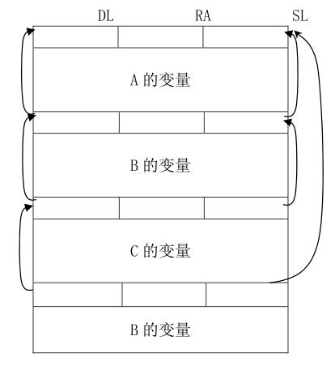
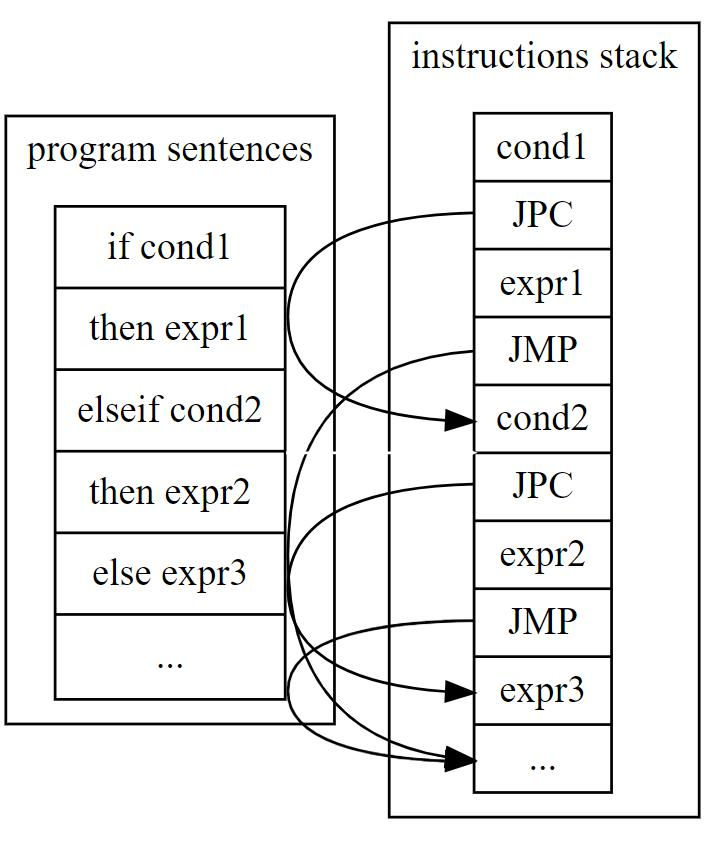
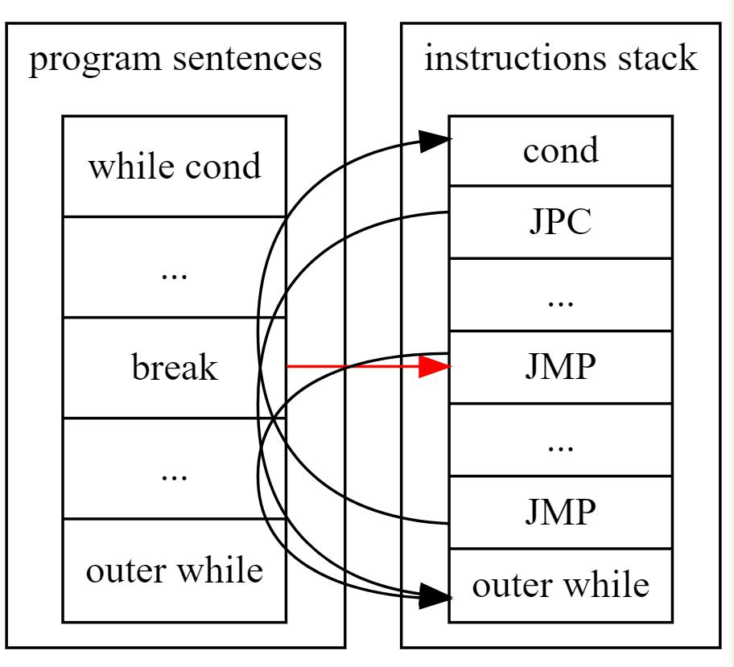

# PL0-compiler
> A compiler for c-like programming language PL0.
# QuickStart
```shell
python parse.py  [-i] [-f file]

-i: output instruction
-f: compile and run the codes stored in file
```

Run 'python parse.py' and enter a REPL state, you can type and run sentences and expressions interactively

# Examples
##  expression-example

run command `python parser.py` to enter repl.

Therer are some expressions and sentence in file testExpr.txt, now test it.
`python parser.py -f test/testExpr.txt`

```c
>> File: "testExpr.txt"
1
2     // expression
3     E.
result: 2.718281828459045,
>> var a,b,c;.
>>  a:=b:=3.
>>  c:=a+1.
>>  c.
result: 4.0,
>>  c+1!=1.
result: True,
>> c+1=5.
result: True,
>> File: "testExpr.txt"
1
2     while c>0 do
3     begin
4         c:= c-1;
5         print('c is:',c);
6     end.
c is: 3.0
c is: 2.0
c is: 1.0
c is: 0.0
>> File: "testExpr.txt"
1
2     ++1--1.
result: 2.0,
>> 1<<2+3%2.
result: 8,
>> 2&1.
result: 0,
>> (1.5+1.5)*-1.1.
result: -3.3000000000000003,
>>   -1+2*3/%2.
result: 2.0,
>>  2-2-.
line 1: 2 - 2 - .
                ^
[Error]: Expect a varible or const or num, got "."
>>    (1+2.
line 1: ( 1 + 2 .
                ^
[Error]: Expect ")", got "."
>> 4!!.
result: 620448401733239439360000,
```

## factorial-example
run
`python parser.py  -if test/testFactorial.txt`

```c
>> File: "testFactorial.txt"
1     func f(n)
2     begin
3         if n=1 then return 1;
4         return n*f(n-1);
5     end;
6
7     var a;
8     begin
9         a:=f(10);
10        print('factorial 10 is:',a);
11    end
12    .
0     ('JMP', 0, 21)
1     ('INT', 0, 4)
2     ('MOV', 4, 0)
3     ('LOD', 0, 3)
4     ('LIT', 0, 1.0)i
5     ('OPR', 2, 'EQ')
6     ('JPC', 0, 10)
7     ('LIT', 0, 1.0)
8     ('OPR', 0, 'POP')
9     ('JMP', 0, 20)
10    ('LOD', 0, 3)
11    ('LOD', 0, 3)
12    ('LIT', 0, 1.0)
13    ('OPR', 2, 'SUB')
14    ('CAL', 1, 1)
15    ('OPR', 1, 'BACK')
16    ('OPR', 0, 'PUSH')
17    ('OPR', 2, 'MUL')
18    ('OPR', 0, 'POP')
19    ('JMP', 0, 20)
20    ('OPR', 0, 'RET')
21    ('INT', 0, 4)
22    ('LIT', 0, 10.0)
23    ('CAL', 0, 1)
24    ('OPR', 1, 'BACK')
25    ('OPR', 0, 'PUSH')
26    ('OPR', 0, 'POP')
27    ('OPR', 0, 'PUSH')
28    ('STO', 0, 3)
29    ('LIT', 0.0, 'factorial 10 is:')
30    ('LOD', 0, 3)
31    ('PRT', 0, 2)
32    ('OPR', 0, 'RET')
factorial 10 is: 3628800.0
result:  3628800.0
```
# Description
## ident type
* constant
* varible
* function
## operator
### relation opr
* \<
* \>
* \<=
* \>=
* = equal 
* !=
* odd  
### bit opr
* \& bitand
* \| bitor
* \~ bitnot
* \<\< left shift
* \>\> right shift
### arithmetic opr
* \+  add/plus
* \-  sub/minus
* \*  multiply
* \/  divide
* \/\% integer div
* %  mod
* \^  power
* \!  factorial
### conditon opr
*  ?:  eg   a\>b ? c:d
## control structure
* if elif else
* for
* while
* break
* continue
* return

# Grammar
```bnf
program =  body "."
body = {varDeclaration ";" |  constDeclaration ";" |  "func" ident "(" arg_list  ")" body ";"}  sentence 

varDeclaration = "var"  varIdent | varDeclaration "," varIdent
varIdent  =  ident | varIdent "[" number "]" 
constDeclaration = "const" ident "=" number {"," ident "=" number}

sentence = [ ident ":=" sentenceValue {":=" sentenceValue}
		|  "begin" sentence { ";" sentence}  "end"
		|  "if" sentenceValue "then" sentence  ["else" sentence]
		|  "while" sentenceValue "do" sentence
		|  "break"
		|  "continue"
		|  ["return"] sentenceValue
		|  "print" "(" real_arg_list ")" ]

sentenceValue =  funcall | condition
conditionValue = funcall|expresssion
funcall =  ident "(" real_arg_list ")"  

arg_list =  ident { "," ident}

real_arg_list = sentenceValue {"," sentenceValue }


condition = condition_or [ "?" sentenceValue ":" sentenceValue ]
condition_or  = condition_and { "||" condition_or }
condition_and = condition_not { condition_not "&&" condition_and}
condition_not = {"!"} condition_unit 
condiiton_unit = ["odd"] conditionValue 
			| conditionValue ("<" | ">" | "<=" | ">=" | "=" | "!=") conditionValue

expression =  level1 { ("<<"| ">>" | "&" | "|") level1 }
level1  = level2 { ( "+" | "-" ) level2 }
level2 = level3 { "*" | "/" | "/%" | "%" ) level3 }
level3 = level4 {"^" level4}
level4 = item {"!"}   
item =  number  |ident { "(" real_arg_list ")" }| "(" sentenceValue" )" | ("+" | "-" | "~" ) item
```
## syntax 
Writet down syntax, then convert left recursion to right recursion.
Namely we should change the following productions:
expr, level0, level, level3

We notice that
```scala
A -> Aa|b
```
equls to 
```scala
A -> bR
R -> nil | aR
```
so here are the  right-recursion productions 
```scala
expr   -> level1 interval1
interval1 -> nil | {&|'|'|>>|<<|} interval1

level1 -> level2 interval2
interval2 -> nli | {+|-} interval2

level2 -> level3 interval3
interval3 -> nil | {*|/|//|%} interval3

level3 -> level4 | level4 ^ level3

level4 -> item interval4 
interval4 -> nil |! interval4

item   -> NUM|E|PI|ln(expr)|(expr)| + item| - item| ~ item
```

When implementing the parser, we can use a loop structure to implement the right recursion because it's tail-recursive.

For instance, we can simply find that the production for `level4` is 
```scala
level4 -> item | item ! | item!! |item !!! | ...
```
Though we can't write a production with infinite loops, we can write it in code like this: 
```python
match_level4():
    result = match(item)
    while if lookAhead  matches item:
        match(!)
        result = factorial(item)
    return result
```

# Instruction generation
We designed several instruction that this compiler generates for the target machine. 
To simplify this problem, we will emulate this virtual machine and execute instructions in python.
## register
This machine has three registers:
* `b` is the base register that contains the base pointer to locate a varible in the data stack
* 'reg' is the return register that contains the  return value of latest function call 
* 'pc' is the pc register that points to the instruction 
## stack
There are two stack in this virtual machine. 
One contains the instructions, visited by register `pc`. It won't change when executing instructions, so we can assume it's readonly
The other is data stack. It dynamiclly changes when running the progrram.

For each level, the first is the base address of this level. The second place is the static chain to visit the upper level's varibles. The third place contains the return address of the upper level.
And the other places in one level contains local varibles and real time data for calculation.


Each time we call a function, the level increases 1. Also, the level decreases 1 when we return from a function.


## instruction
Every instruction consists of three parts. The first is the name of the instruction. Generally, the second is the level diifference of a identifier(if it has). And the third part is the address.

name | levelDiff | address | explanation
:-:|:-:|:-:|:-:
INT|-|n|allocate n space for one level
LIT|-|constant value| push a constant value to the top of the data stack
LOD | levelDiff|addr | load a varible value to the top of the data stack. The var can be found use levelDiff and addr
STO|levelDiff|addr| store the stack top value to a varible, top decreases. 
CAL|levelDiff|addr|call a function
JMP |-|addr|jmp to addr, namely set addr to pc
JPC|-|addr| pop stack, if the value is not True, jmp addr
MOV|n1|n2|  stk[top-n2] = stk[top-n1]
OPR |-| RET| return to the upper level, use current level's first three value to change pc, data stack, base register.
OPR | -|POP| pop the data stack, store the value in `reg` register
OPR|-|PUSH| push `reg` to stack top
OPR|n|BACK|  rewind stk.top backward n steps
OPR|-|operator type| variout operation on value

# Design
We can generate instruction when analyse grammar. 
Some keypoints is the control structures' instruction traslation.
## if elif else

## while/break

`continue`, `for`  can be translated in the same way.
## instruction fillback
Taking `while` block as an example, Note that we don't know the `JPC` instruction's target addr until we finish analysing the whole block.The Solution is that after we analyse while condition, we generate an instruction with no target address, just take a place. We note down this instruction's address. As soon as we finish analyse the whole  `while` block, the instruction pointer, namely `ip`, pointing to the target address of `JPC`. Then we fill back the `JPC` instruction with the target address along to ip.

## symbol table
There are three types of symbols:
* constant
* varible
* function name

Since the compiler allow same name varibles in different function (may be in the same level), I designd the symbol table to achieve it conveniently.

For global identifiers, they are in the symbols dict. And there is no same names for different identifiers.
For function arguments, local varibles, I store them in the function symbol's `args` dict, so there won't be conflits when different functions have same local varible names.

When analysing and translating, we want to get the symbol which including level, address,(value for constant) according to its name.

For global identifiers, it is so easy.
For function arguments, we need the function symbol. 
So I use a `curFunc` varible to  note down in which function the identifier is visited.

Every time when callling a function `f`, we do the following things
```python
saved = curFunc
curFunc = f
call f
curFunc = saved
```
This ensures that we can get the symbol accoding to a name of an identifier.

## features
* bullutin function: print(a,b,c...)
# To do
* [] array
* [] different value pass
* [] do while, switch
* [] function pass
* [] type 
